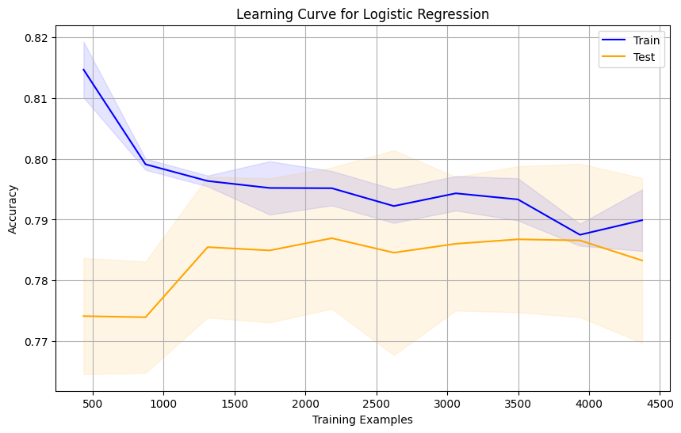
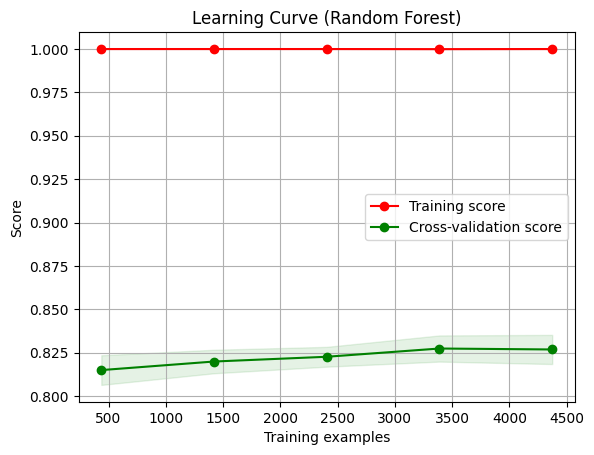

# Cirrhosis_prediction
This repository contains a Kaggle challenge focused on survival outcomes for Cirrhosis patients.
------

## Overview
The challenge tasks participants with using a multi-class approach to predict outcomes for cirrhosis patients. Each patient's true class label (Status) needs to be predicted as one of three possibilities: Status_C, Status_CL, or Status_D. The repository's approach involves employing various machine learning algorithms to solve this multi-class classification problem. The best-performing model achieved an accuracy of 82.5%, indicating its ability to correctly predict outcomes for 82.5% of cases.

## Summary of Workdone

### Data
The data provided for this challenge is synthetic and originates from a deep learning model trained on the Cirrhosis Patient Survival Prediction dataset. It's in the form of a CSV file containing features, aimed at predicting probabilities for three outcomes: Status_C, Status_CL, and Status_D. The dataset is 1.39 MB in size and includes 5468 patients in the training set and 1368 patients in the test set.

#### Preprocessing / Clean up
* **Handling Missing Values:** Checked for missing values in the dataset. For numerical features, fill missing values with the mean or median of the respective column. For categorical features, fill missing values with the mode.
* **Outlier Detection and Removal:** Identified outliers using the z-score method and removed them to prevent skewing the model's performance.
* **Dropping Unnecessary Columns:** Dropped columns that were not useful for analysis or modeling, such as 'id' columns or columns with high cardinality.

### Feature Engineering
* **One-Hot Encoding:** Applied one-hot encoding to categorical variables to convert them into a format suitable for machine learning algorithms.
* **Box-Cox Transformation:** Performed Box-Cox transformation on numerical features to normalize their distribution.
* **Standardization:** Standardized numerical features to bring them to the same scale using StandardScaler from scikit-learn.

#### Data Visualization


### Problem Formulation
  * Input: CSV file of features; Output: Predicted probabilities for each of the three possible outcomes: Status_C, Status_CL, and Status_D.
  * Models
    * Logistic Regression: A simple linear model used for binary and multi-class classification tasks. Logistic regression was chosen as it is interpretable, computationally efficient, and serves as a baseline model.
    * Random Forest: An ensemble learning method that constructs multiple decision trees during training and outputs the mode of the classes for classification tasks. Random forest was selected for its ability to handle non-linear relationships, handle categorical variables, and reduce overfitting.

### Training
The training process utilized the scikit-learn library within a Jupyter Notebook environment for code execution and analysis.



### Performance Comparison

Accuracy measures the overall correctness of the predictions, precision quantifies the ratio of correctly predicted positive observations to the total predicted positives, recall measures the ratio of correctly predicted positive observations to the actual positives, and F1-score provides a harmonic mean of precision and recall.
*  


### Future Work
Model Selection: Experiment with more advanced machine learning algorithms or ensemble methods, such as gradient boosting machines (e.g., XGBoost, LightGBM) or neural networks, to improve predictive performance.

### Overview of files in repository


### 🧩 Data Access
The Cirrhosis dataset is available on Kaggle:
[Playground Series – S3E26](https://www.kaggle.com/competitions/playground-series-s3e26)

To download:
```bash
kaggle competitions download -c playground-series-s3e26 -p data/raw
```

## Citations
* [Kaggle Challenge link.](https://www.kaggle.com/competitions/playground-series-s3e26/data)
